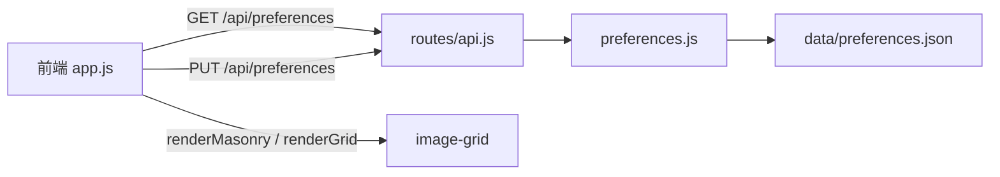

# 布局切换（瀑布流/网格）

Feature Name: layout-switch
Updated: 2026-08-16

## Description

在图片宫格新增瀑布流与网格两种布局模式，通过排序栏上的单个切换按钮切换。布局偏好按账号存储于服务端，跨设备保持一致。默认网格布局。瀑布流列宽随缩略图尺寸档位（160/240/320）变化。

## Architecture



- 前端在登录后拉取布局偏好并应用；切换时立即重绘并 PUT 保存到服务端。
- 服务端提供 `GET/PUT /api/preferences`，读写 `data/preferences.json`（按用户名分键）。
- 渲染层根据 `state.layoutMode` 分别走网格渲染或瀑布流渲染。

## Components and Interfaces

### 服务端

- `src/preferences.js`：用户偏好存储模块
  - `getPreferences(username)`: 返回 `{ layout: 'grid' | 'masonry' }`，无记录时返回默认 `{ layout: 'grid' }`
  - `setPreference(username, key, value)`: 写入单键偏好，落盘 `data/preferences.json`
  - 内部以 `{ [username]: { layout } }` 结构保存；写操作串行化，避免并发覆盖
- `src/routes/api.js` 新增端点（均需 `requireAuth`）：
  - `GET /api/preferences` → `200 { layout }`
  - `PUT /api/preferences` body `{ layout }`，合法值仅 `grid | masonry`，否则 `400`；成功 → `200 { layout }`

### 前端

- `state.layoutMode`：`'grid' | 'masonry'`，默认 `'grid'`，登录后由服务端偏好覆盖
- 排序栏内缩略图尺寸按钮右侧新增切换按钮 `#layout-switch-btn`：
  - 当前 `grid` 时文案"瀑布流"，点击切到 `masonry`
  - 当前 `masonry` 时文案"网格"，点击切到 `grid`
  - 点击后：更新 `state.layoutMode`、刷新按钮文案、`PUT` 保存、重绘当前宫格
- 渲染：
  - `renderMediaGrid` 增加分支，根据 `state.layoutMode` 调用 `renderGrid(items)` 或 `renderMasonry(items)`
  - 网格渲染沿用现有 `image-grid`（`data-size` 控制列宽）
  - 瀑布流渲染：根据容器宽度与尺寸档计算列数 `N`，创建 `N` 个 flex 列，按当前最短列依次分配 item，保持 DOM 顺序（排序不变）；item 宽度 = 列宽，图片加载后自然呈现不同高度
- `applyThumbSize` 仍作用于 `#image-grid` 容器；瀑布流模式下列宽同步取当前尺寸档

## Data Models

`data/preferences.json`:

```json
{
  "admin": { "layout": "masonry" }
}
```

- 键：用户名（`req.session.user`）
- 值：`{ layout: 'grid' | 'masonry' }`，缺省 `grid`

## Correctness Properties

- 布局模式取值仅限 `grid` / `masonry`，非法值在服务端被拒绝（400）
- 无偏好记录时默认网格布局
- 切换布局保持浏览目录、分页、排序与缩略图尺寸档位不变
- 瀑布流按当前最短列分配，DOM 顺序与排序结果一致
- 未登录用户访问 `/api/preferences` 返回 401

## Error Handling

- `PUT /api/preferences` body 缺失或 `layout` 非法 → `400 { error }`
- 偏好文件读取失败 → 按无记录处理（返回默认布局）
- 偏好文件写入失败 → 返回 `500 { error }`，前端保留当前布局但提示保存失败（可忽略，下次登录恢复旧值）

## Test Strategy

- 接口：登录后 `GET /api/preferences` 返回默认 `{ layout: 'grid' }`；`PUT { layout: 'masonry' }` 后再次 `GET` 返回 `masonry`；非法值返回 400；未登录返回 401；再次登录偏好仍为 `masonry`
- 前端：切换按钮文案随布局变化；瀑布流下缩略图尺寸档位改变列数/列宽；切换布局后目录与分页不变
- 回归：网格布局渲染、排序、分页、缩略图懒加载不受影响

## References

[^1]: (src/routes/api.js) - API 路由，含 `requireAuth`、登录与现有 thumb/image 端点
[^2]: (public/js/app.js) - `renderMediaGrid`（455 行）、`applyThumbSize`（95 行）、缩略图尺寸状态
[^3]: (public/index.html) - 排序栏与缩略图尺寸按钮组结构
[^4]: (public/css/style.css) - `.image-grid` 网格布局与 `data-size` 列宽样式
