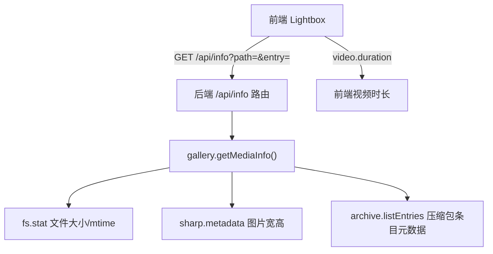

# Lightbox 详情面板

Feature Name: 2026-08-15-lightbox-info-panel
Updated: 2026-08-15

## Description

在 lightbox 放大预览视图中新增右侧详情面板。面板默认收起，用户通过工具栏切换按钮展开或收起。展开时展示当前媒体（图片或视频）的标准元数据：文件名、路径、类型、文件大小、修改时间；图片额外显示宽高尺寸，视频额外显示播放时长；压缩包内条目额外显示所属压缩包与条目路径。切换上/下一张时面板内容同步刷新。

## Architecture



前端在播放视频时通过 `<video>` 元素的 `duration` 属性获取播放时长（无需后端 ffprobe 依赖）；后端仅返回文件系统元数据与图片尺寸。

## Components and Interfaces

### 后端组件

#### 新端点: `GET /api/info`

- Query 参数: `path`（图库内相对路径，必填）、`entry`（压缩包内条目名，可选）
- 认证: 需登录（`requireAuth`）
- 响应示例:

```json
{
  "name": "photo.jpg",
  "path": "album/photo.jpg",
  "type": "image",
  "location": "filesystem",
  "sizeBytes": 245760,
  "sizeText": "240.0 KB",
  "mtime": 1755200000000,
  "mtimeText": "2026-08-15 10:00:00",
  "width": 1920,
  "height": 1080
}
```

压缩包内条目的响应额外包含 `archiveName` 与 `entry` 字段，`location` 为 `archive`。

#### 新函数: `gallery.getMediaInfo(relPath, entryName)`

- 文件系统媒体: 通过 `fs.stat` 获取 `sizeBytes`、`mtime`；图片通过 `sharp.metadata` 获取 `width`、`height`
- 压缩包条目: 通过 `archive.listEntries` 获取条目大小与修改时间；条目为图片时读取字节缓冲后用 sharp 获取宽高
- 统一格式化为 `sizeText`（<1MB 用 KB，≥1MB 用 MB）与 `mtimeText`

### 前端组件

#### index.html

- lightbox 工具栏新增切换按钮 `#lb-info-toggle`（"ℹ 信息"）
- lightbox 结构新增右侧面板容器 `#lb-info-panel`（含字段列表区域与加载/错误提示区）

#### app.js

- 新增 `toggleInfoPanel()` 与 `renderInfoPanel()` 函数
- `openLightbox()` 时保证面板收起（`#lb-info-panel` 移除展开类）
- `updateLightbox()` 在面板展开时重新请求 `/api/info` 并刷新内容
- 视频时长为空时监听 `loadedmetadata` 后回填，或读取 `#lb-video.duration`
- 点击切换按钮切换面板展开状态；`Escape` 关闭 lightbox 时同步收起

#### style.css（扁平化风格）

- `.lb-info-panel` 为 lightbox 右侧固定宽面板，白色背景、1px 边框
- `.lb-info-panel.open` 控制展开；收起时 `display:none`
- 字段行 `.info-row` 使用 label/value 两列布局

## Data Models

### MediaInfo

| 字段 | 类型 | 说明 |
|------|------|------|
| name | string | 文件名 |
| path | string | 图库内相对路径（压缩包内为条目路径） |
| type | enum('image','video') | 媒体类型 |
| location | enum('filesystem','archive') | 存储位置 |
| archiveName | string? | 所属压缩包文件名（仅压缩包内） |
| entry | string? | 压缩包内条目名（仅压缩包内） |
| sizeBytes | number | 字节大小 |
| sizeText | string | 格式化大小（KB/MB） |
| mtime | number | 修改时间戳（毫秒） |
| mtimeText | string | 格式化修改时间 |
| width | number? | 图片宽度（仅图片） |
| height | number? | 图片高度（仅图片） |

## Correctness Properties

1. 详情面板默认收起，打开 lightbox 时不占用布局空间
2. 面板展开状态下，面板内容与当前 lightbox 索引对应的媒体一致
3. 切换上/下一张后，面板内容同步更新为当前媒体
4. 图片类型仅返回宽高；视频类型仅返回时长（由前端填充）
5. `sizeText` 与 `mtimeText` 为稳定可读格式
6. 路径穿越（超出图库根目录）被拒绝并返回 403
7. 媒体文件或压缩包条目不存在时返回 404

## Error Handling

| 场景 | 处理方式 |
|------|----------|
| `path` 参数缺失 | 返回 400 错误 |
| 媒体文件不存在 | 返回 404 "文件不存在" |
| 压缩包条目不存在 | 返回 404 "文件不存在" |
| 路径超出图库根目录 | 返回 403 "访问被拒绝"（现有 errorHandler） |
| sharp 无法读取图片尺寸 | 省略 width/height 字段，不影响其他字段 |
| 前端元数据请求失败 | 面板展示错误提示文案，不中断 lightbox |

## Test Strategy

### 后端集成测试（test.js 扩展）

1. 登录后请求 `GET /api/info?path=<存在的图片>`，断言返回 `name`、`type`、`sizeBytes`、`sizeText`、`width`、`height`、`mtimeText` 字段
2. 请求 `GET /api/info?path=<存在的视频>`，断言返回 `type=video` 且无 `width`/`height` 字段
3. 请求不存在的路径，断言 404
4. 未登录请求 `/api/info`，断言 401
5. 路径穿越请求（如 `../`），断言 403 或 400

### 前端手动验证

1. 打开 lightbox 后面板默认收起
2. 点击切换按钮展开面板，字段完整且格式正确
3. 点击上一张/下一张，面板内容同步更新
4. 视频时长在加载完成后正确显示
5. 再次点击切换按钮收起面板

## References

- (Filename#Lnnn) - [前端 lightbox 逻辑](public/js/app.js#L419-L492)
- (Filename#Lnnn) - [lightbox DOM 结构](public/index.html#L66-L89)
- (Filename#Lnnn) - [图片缩略图与 sharp 用法](src/thumbnail.js#L20-L29)
- (Filename#Lnnn) - [API 路由定义](src/routes/api.js#L84-L88)
- (Filename#Lnnn) - [压缩包条目元数据](src/archive.js#L60-L68)
