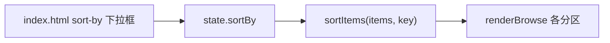

# 排序新增修改时间

Feature Name: sort-by-modified-time
Updated: 2026-08-16

## Description

排序方式新增"修改时间"，默认按修改时间倒序（最新修改排最前）。纯前端变更：调整默认排序状态与排序下拉框选项。排序逻辑沿用现有 `sortItems`，服务端 `mtime` 字段已提供。

## Architecture

## Components and Interfaces

- `public/index.html`：`#sort-by` 下拉框新增"修改时间"选项（值 `time`，默认选中）；`#sort-order` 默认选中"倒序"
- `public/js/app.js`：
  - `state.sortBy` 默认值由 `'name'` 改为 `'time'`
  - `state.sortOrder` 默认值由 `'asc'` 改为 `'desc'`
  - `sortItems` 已支持 `time` 键（按 `mtime` 排序，同值回退文件名），无需改动

## Data Models

无新增。复用服务端返回的 `mtime`（毫秒时间戳）字段：
- 目录模式：`listGalleryDir` 返回 `folders/archives/images/videos` 均含 `mtime`
- 压缩包模式：`listArchiveMedia` 返回条目均含 `mtime`

## Correctness Properties

- 默认排序为修改时间倒序，最新修改排最前
- 修改时间相同的项按文件名（中文 localeCompare）排序
- 排序对文件夹、压缩包、图片、视频统一生效
- 用户手动切换排序后，以用户选择为准

## Error Handling

无新增错误路径。`mtime` 缺失时按 0 处理（排在最早）。

## Test Strategy

- 前端：默认 `#sort-by` 选中"修改时间"、`#sort-order` 选中"倒序"；渲染后最新修改的项位于最前
- 回归：切换"文件名"排序仍按名称排列；切换正序/倒序正常

## References

[^1]: (public/js/app.js) - `state.sortBy/sortOrder` 默认值、`sortItems`（339 行）
[^2]: (public/index.html) - 排序下拉框结构
[^3]: (src/gallery.js) - `listGalleryDir`、`listArchiveMedia` 返回 `mtime` 字段
