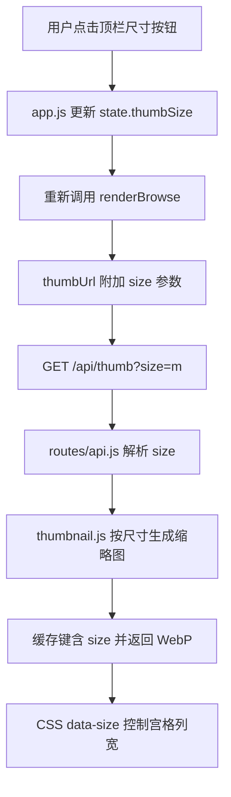

# 缩略图尺寸调整（大中小三档）

Feature Name: thumbnail-size-control
Updated: 2026-08-16

## Description

浏览区图片宫格支持小、中、大三档缩略图尺寸：小 160px、中 240px、大 320px。默认中尺寸。切换控件为顶栏右上角三个并排按钮（小/中/大），当前尺寸高亮。各尺寸下通过后端生成对应宽度的缩略图，避免放大模糊。

## Architecture



架构说明：

- 尺寸切换为纯前端状态变更，通过重新渲染当前浏览区即时生效，不重置目录与分页
- 缩略图请求携带 `size` 参数，后端按需生成对应宽度的 WebP 缓存，保证大尺寸显示清晰
- CSS 通过 `.image-grid` 的 `data-size` 属性驱动宫格最小列宽

## Components and Interfaces

### 前端 `public/index.html`

顶栏右侧按钮组（置于当前用户名与退出登录按钮之间）：

```html
<div class="topbar-right">
  <div id="thumb-size-group" class="thumb-size-group">
    <button data-size="s" class="thumb-size-btn" title="小尺寸">小</button>
    <button data-size="m" class="thumb-size-btn" title="中尺寸">中</button>
    <button data-size="l" class="thumb-size-btn" title="大尺寸">大</button>
  </div>
  <span id="current-user" class="user"></span>
  <button id="btn-logout" class="btn-ghost">退出登录</button>
</div>
```

### 前端 `public/js/app.js`

- `state` 新增字段 `thumbSize: 'm'`（默认中尺寸）
- `thumbUrl(item)` 追加 `&size=${state.thumbSize}` 查询参数
- 新增事件绑定：点击 `.thumb-size-btn` 时更新 `state.thumbSize`、同步高亮态、调用 `renderBrowse()` 重新渲染
- `renderBrowse()` 时根据 `state.thumbSize` 设置 `#image-grid.dataset.size`

### 前端 `public/css/style.css`

- `.thumb-size-group` 顶栏按钮组样式（与 `.btn-ghost` 风格协调）
- `.thumb-size-btn.active` 高亮样式
- `.image-grid` 根据 `data-size` 设置列宽：

```css
.image-grid[data-size="s"] { grid-template-columns: repeat(auto-fill, minmax(160px, 1fr)); }
.image-grid[data-size="m"] { grid-template-columns: repeat(auto-fill, minmax(240px, 1fr)); }
.image-grid[data-size="l"] { grid-template-columns: repeat(auto-fill, minmax(320px, 1fr)); }
```

### 后端 `src/thumbnail.js`

- `getThumbForFile(filePath, width)` 与 `getThumbForArchiveEntry(archivePath, entryName, width)` 增加宽度参数
- `cacheKey` 增加 width 维度，保证不同尺寸生成独立缓存
- 视频缩略图 `generateThumbFromVideo` 同步支持目标宽度

### 后端 `src/routes/api.js`

- `/thumb` 路由解析 `size` 查询参数，映射表：`s→160`、`m→240`、`l→320`
- 未传 `size` 时沿用现有 `config.thumbSize`（默认 320），保持向后兼容
- 非法 `size` 值忽略并回退默认值

## Data Models

尺寸映射表（前后端共用约定）：

| 标识 | 显示宽度 | 说明 |
|------|---------|------|
| `s`  | 160px   | 小尺寸 |
| `m`  | 240px   | 中尺寸（默认） |
| `l`  | 320px   | 大尺寸 |

缩略图缓存键：`cacheKey('file', filePath, size, mtime, width)` / `cacheKey('archive', archivePath, size, mtime, entryName, width)`。

## Correctness Properties

- 首次登录默认 `thumbSize = 'm'`，宫格以 240px 最小列宽渲染
- 切换尺寸时目录、分页、排序状态保持不变，仅重绘图片宫格
- 三个按钮有且仅有一个处于高亮态
- 大/中/小尺寸分别请求宽度不低于 320/240/160 的缩略图
- 后端 `size` 参数非法时回退默认宽度，不产生错误响应

## Error Handling

- 缩略图生成失败沿用现有 `errorHandler`，返回 500 且仅在生产环境暴露通用错误信息
- 非法 `size` 值忽略并回退默认宽度
- 压缩包内条目缺失继续沿用现有 404 处理

## Test Strategy

- 手工脚本验证：`node test.js` 确认现有功能无回归
- 启动服务后验证：
  1. 默认进入浏览区宫格列宽为中尺寸（240px）
  2. 依次点击小/中/大按钮，宫格列宽即时变化且当前按钮高亮
  3. 切换尺寸后目录、分页、排序保持不变
  4. 抓取 `/api/thumb?size=l` 返回图片宽度不小于 320px
  5. 刷新页面后重新登录，仍默认中尺寸

## References

[^1]: (Filename#L533) - [.image-grid 现有宫格样式](public/css/style.css)
[^2]: (Filename#L409) - [thumbUrl 现有缩略图 URL 构造](public/js/app.js)
[^3]: (Filename#L117) - [/thumb 路由现有实现](src/routes/api.js)
[^4]: (Filename#L62) - [getThumbForFile 现有实现](src/thumbnail.js)
